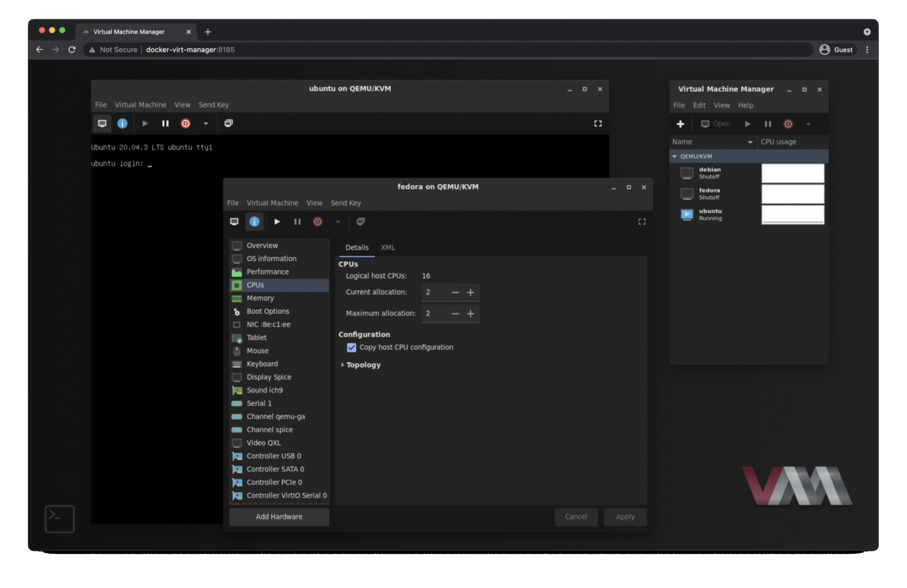

[](https://github.com/m-bers/docker-virt-manager/actions/workflows/deploy.yml)[](https://hub.docker.com/r/mber5/virt-manager)
# Docker virt-manager
### GTK Broadway web UI for libvirt


## What is it? 
virt-manager: https://virt-manager.org/  
broadway: https://developer.gnome.org/gtk3/stable/gtk-broadway.html


## Features:
* Uses GTK3 Broadway (HTML5) backend--no vnc, xrdp, etc needed!
* Password/SSH passphrase support via ttyd (thanks to [@obazda20](https://github.com/obazda20/docker-virt-manager) for the idea!) Just click the terminal icon at the bottom left to get to the password prompt after adding an ssh connection. 


* Dark mode

## Requirements:
git, docker, docker-compose, at least one libvirt/kvm host

## Usage

### docker-compose

If docker and libvirt are on the same host
```yaml
services: 
  virt-manager:
    image: mber5/virt-manager:latest
    restart: always
    ports:
      - 127.0.0.1:8185:80
    environment:
    # Set DARK_MODE to true to enable dark mode
      DARK_MODE: false

    # Set HOSTS: "['qemu:///session']" to connect to a user session
      HOSTS: "['qemu:///system']"

    # If on an Ubuntu host (or any host with the libvirt AppArmor policy,
    # you will need to use an ssh connection to localhost
    # or use qemu:///system and uncomment the below line

    # privileged: true

    volumes:
      - "/var/run/libvirt/libvirt-sock:/var/run/libvirt/libvirt-sock"
      - "/var/lib/libvirt/images:/var/lib/libvirt/images"
    devices:
      - "/dev/kvm:/dev/kvm"
```
If docker and libvirt are on different hosts
```yaml
services: 
  virt-manager:
    image: mber5/virt-manager:latest
    restart: always
    ports:
      - 127.0.0.1:8185:80
    environment:
    # Set DARK_MODE to true to enable dark mode
      DARK_MODE: false

      # Substitute comma separated qemu connect strings, e.g.: 
      # HOSTS: "['qemu+ssh://user@host1/system', 'qemu+ssh://user@host2/system']"
      HOSTS: "[]"
    # volumes:
      # If not using password auth, substitute location of ssh private key, e.g.:
      # - /home/user/.ssh/id_rsa:/root/.ssh/id_rsa:ro
```
### Building from Dockerfile
```bash
    git clone https://github.com/m-bers/docker-virt-manager.git
    cd docker-virt-manager
    docker build -t docker-virt-manager . && docker-compose up -d
```
Go to http://localhost:8185 in your browser.

### Security Warning

It is highly suggested to not change the default binding address (`127.0.0.1`), to prevent computers connected in the same Local Area Network of your hypervisor access to _virt-manger_.

It is also worth mentioning that a **[very motivated attacker having access to your LAN, could still be able to access even when binded on `127.0.0.1`](https://gist.github.com/guns/1dc1742dce690eb560a3a2d7581a9632)**.