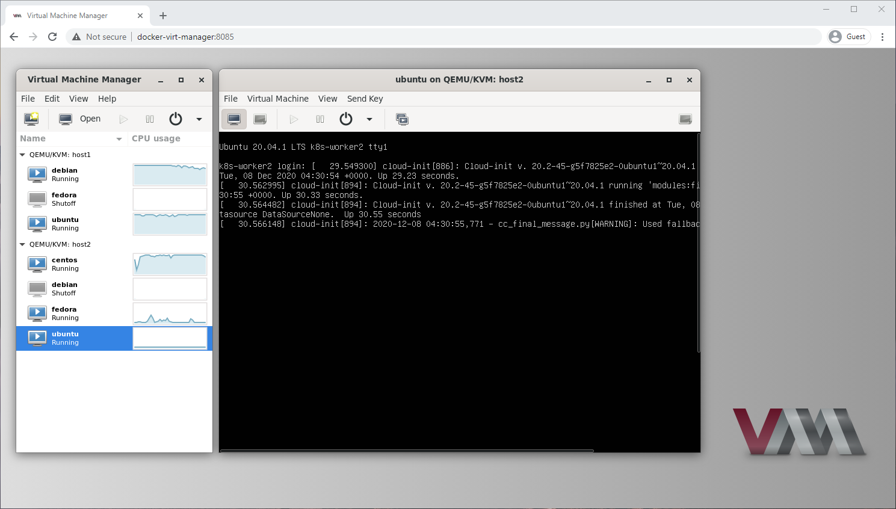

# Docker virt-manager
## `webui for libvirt/kvm`

### What is it? 
virt-manager: https://virt-manager.org/  
broadway: https://developer.gnome.org/gtk3/stable/gtk-broadway.html

### Features:
Uses GTK3 Broadway (HTML5) backend--no vnc, xrdp, etc needed!

### Requirements:
git, docker, docker-compose, at least one libvirt/kvm host

### Usage: 

    git clone https://github.com/m-bers/docker-virt-manager.git
    cd docker-virt-manager
    docker build -t docker-virt-manager . && docker-compose up -d
    
Go to http://localhost:8185 in your browser

### Notes:
In the `docker-compose.yml`, supply your own ssh key (that you've already deployed to libvirt hosts) as a `volume` and libvirt connection strings in the `HOSTS` environment variable, e.g.

    environment:
      HOSTS: "['qemu+ssh://user@host1/system', 'qemu+ssh://user@host2/system']"
    volumes:
      - ~/.ssh/id_rsa:/home/user/.ssh/id_rsa:ro
      
### To do:
Publish to Docker Hub  
Make a base image for broadway  
Customizable options for virt-manager via gsettings and environment variables  
